# GoF Design Pattern Catalog 23

## Creational / 生成 (5)

| No. | Pattern Name | Summary |
| -- | -- | -- |
| 1 | Abstract Factory | Creation by abstracted factory classes. Basic of creational patterns.   抽象化ファクトリクラスによる生成。生成パターンの基本。 |
| 2 | Builder | Creation of composite objects.  複合オブジェクトの作成。 |
| 3 | Factory Method | Creation by abstracted factory methods.   抽象化ファクトリメソッドによる生成。 |
| 4 | Prototype | Creation by copying of prototype instances.   原型インスタンスのコピーによる生成。 |
| 5 | Singleton | Only one, single instance.   唯一、単体のインスタンス。 |

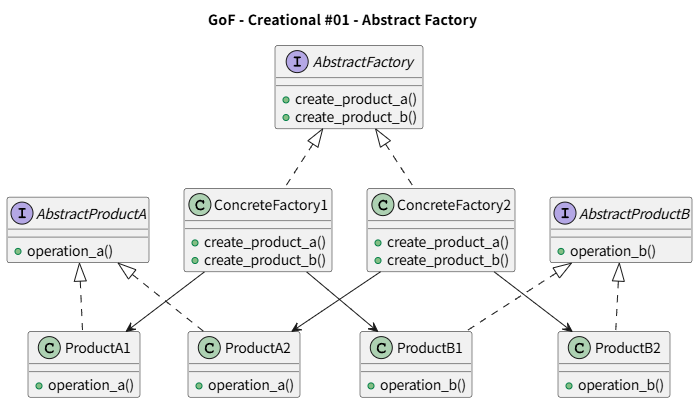
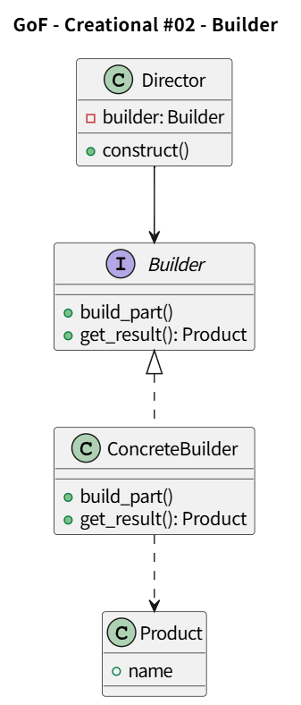
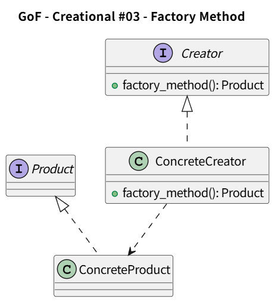
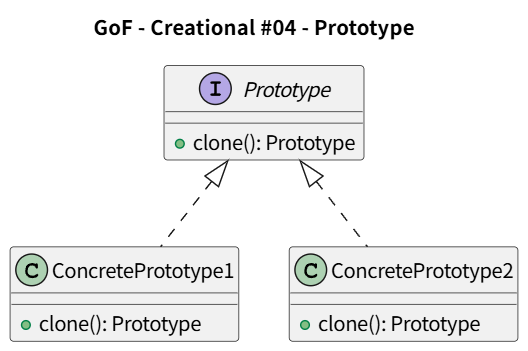
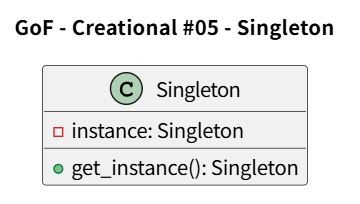

## Structural / 構造 (7)

| No. | Pattern Name | Summary |
| -- | -- | -- |
| 1 | Adapter | インターフェースを変換する |
| 2 | Bridge | クラスと実装を分離する |
| 3 | Composite | 『部分－全体』を表現する木構造 |
| 4 | Decorator | オブジェクトに責任を動的に追加する |
| 5 | Facade | 複数のインターフェースに1つの統一インターフェースを与える |
| 6 | Flyweight | 多数の細かいオブジェクトを効率良く扱う共有の仕組み |
| 7 | Proxy | 代理オブジェクト |

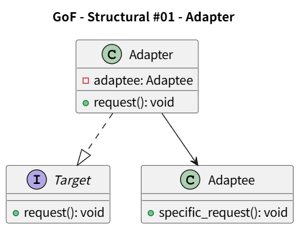
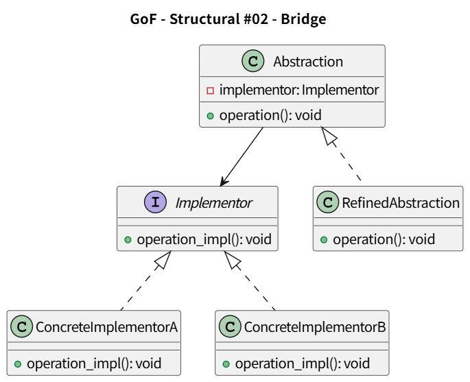
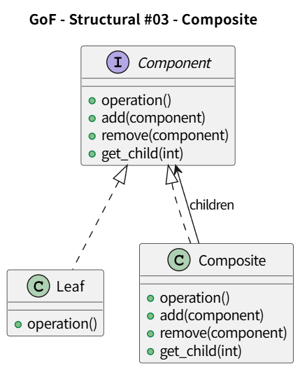
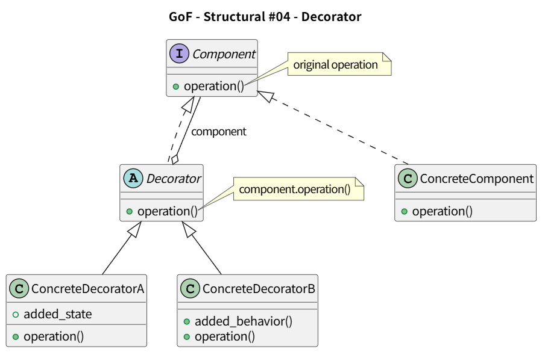
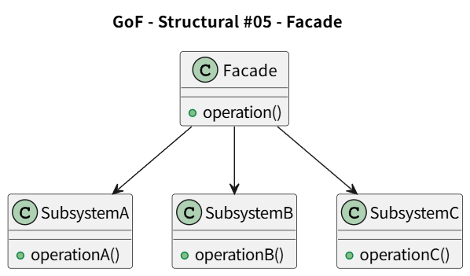
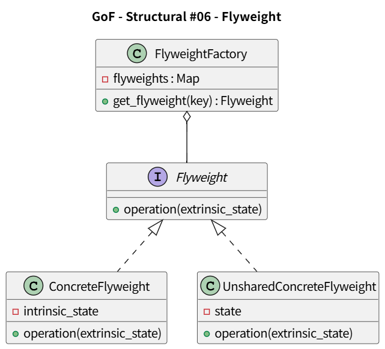
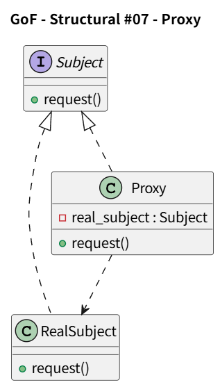

## Behavioral / 振る舞い (11)

| No. | Pattern Name | Summary |
| -- | -- | -- |
| 1 | Chain of Responsibility | 要求を受信するオブジェクト群をチェーン状につなぐ |
| 2 | Command | 要求をオブジェクトとしてカプセル化する |
| 3 | Interpreter | 言語に対する文法表現と文の解釈を一緒に定義する |
| 4 | Interator | 集約オブジェクトの要素に順にアクセスする |
| 5 | Mediator | オブジェクト群の相互作用をカプセル化するオブジェクトを定義する |
| 6 | Memento | オブジェクトの内部状態を外面化して、戻すことができるようにする |
| 7 | Observer | 状態変化の通知 |
| 8 | State | 状態に応じた振る舞い |
| 9 | Strategy | アルゴリズムのカプセル化と交換 |
| 10 | Template Method | 処理の骨格定義と具象化 |
| 11 | Visitor | データ構造と処理の分離 |

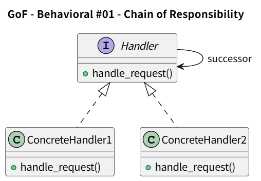
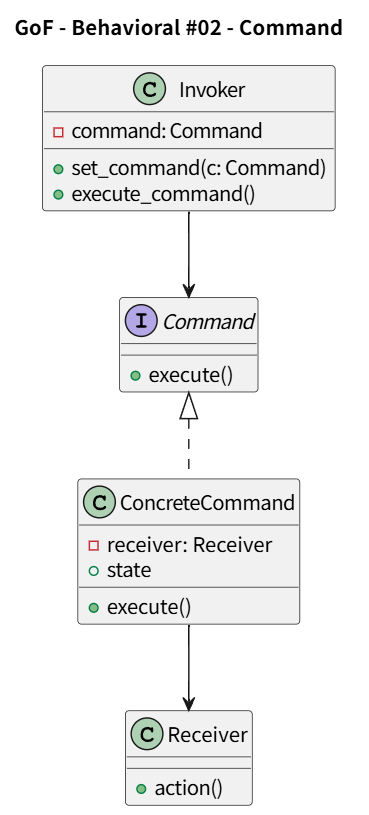
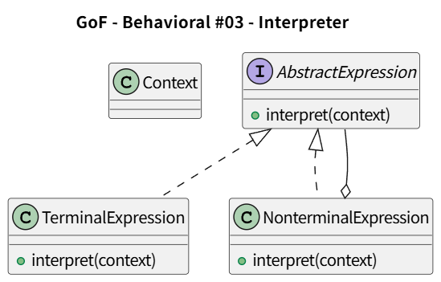
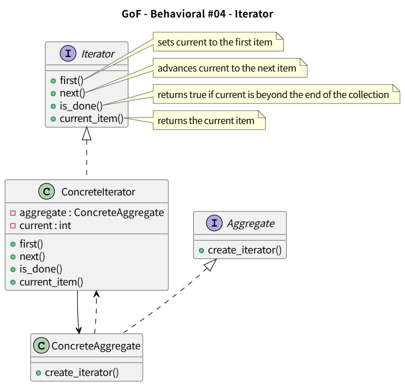
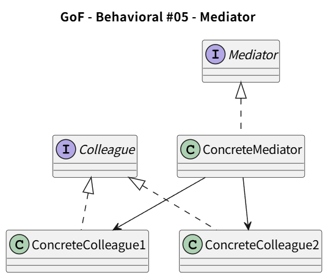
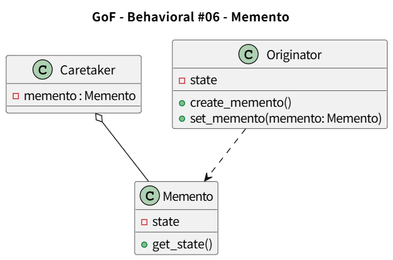
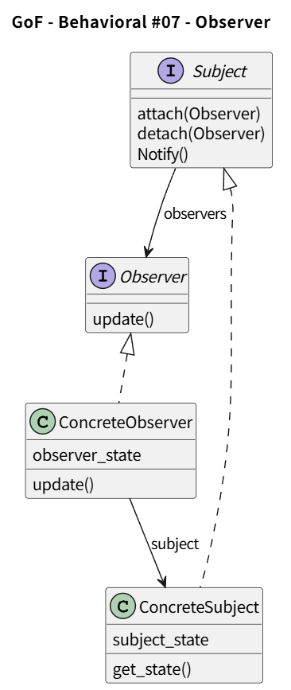
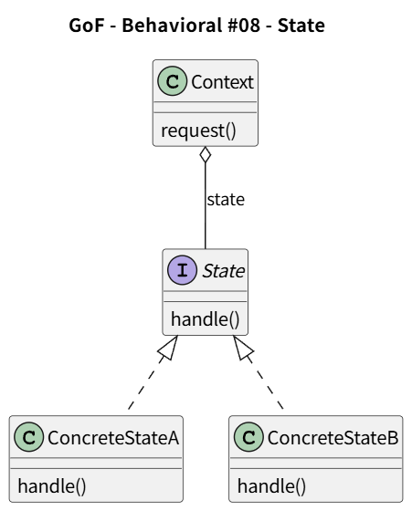
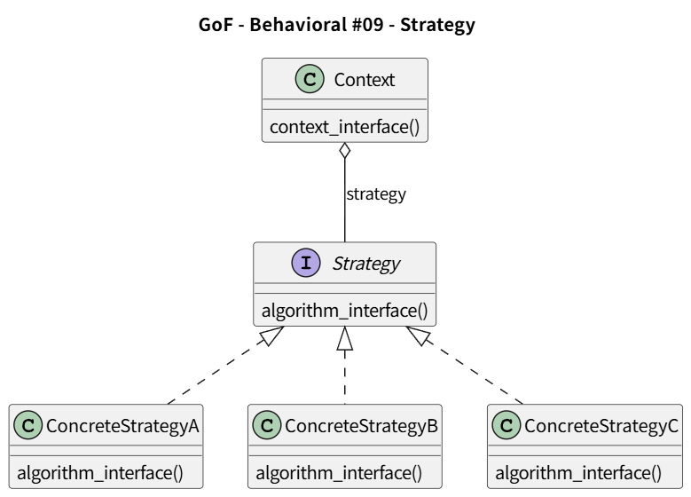
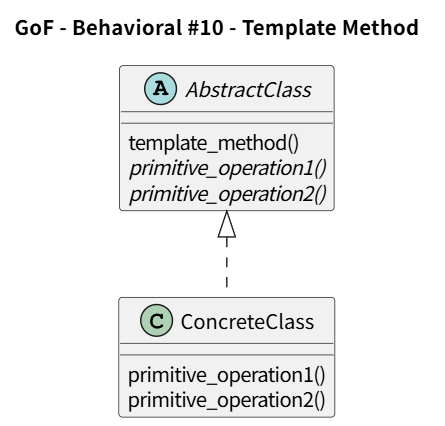
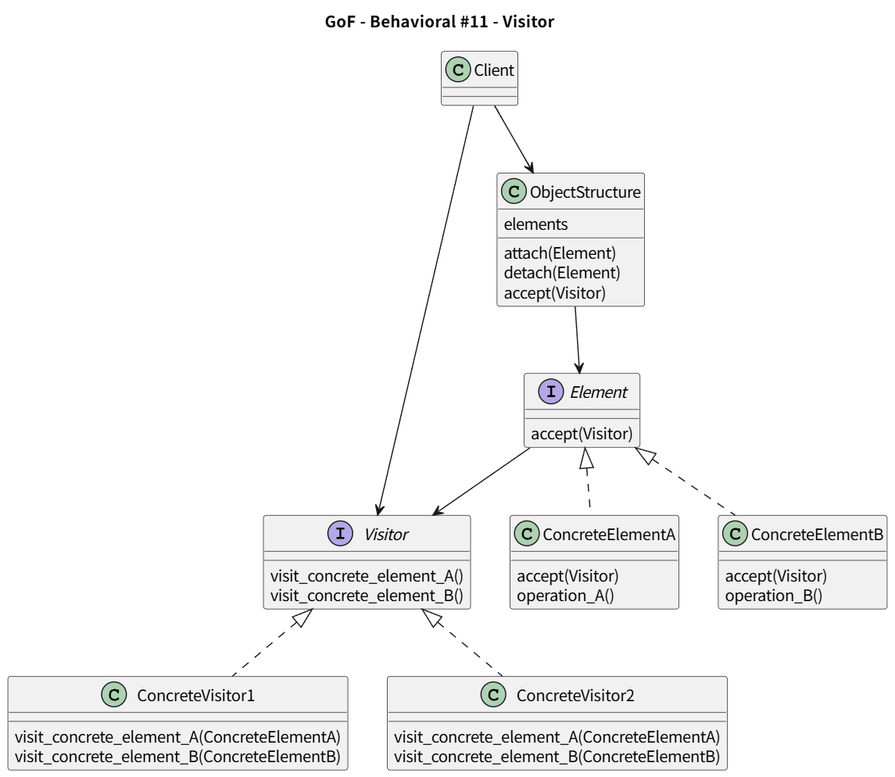

## 文献
* オブジェクト指向における再利用のためのデザインパターン 改訂版, Erich Gamma / Richard Helm / Ralph Johnson / John Vlissides 著、本位田 真一 / 吉田 和樹 監訳, ソフトバンククリエイティブ(株), 1999
